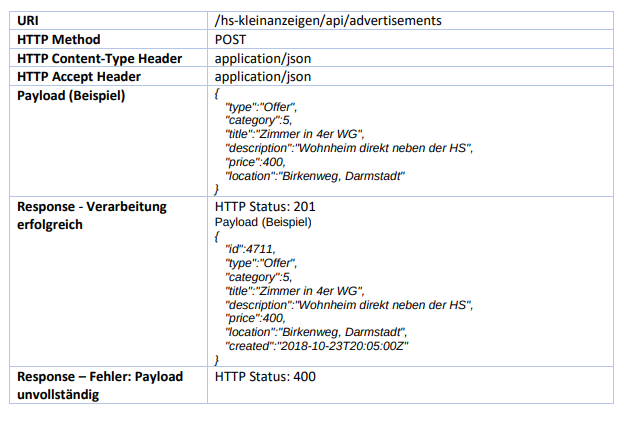
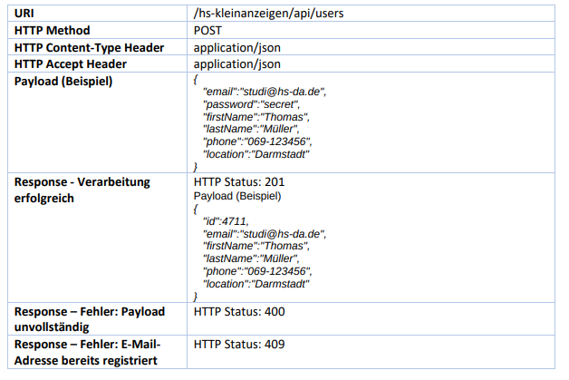

# HS Kleinanzeigen
Die Anwendung erlaubt es, Kleinanzeigen zu verwalten. Es ist möglich nach Anzeigen zu suchen oder 
selbst einzustellen. Die Anwendung wurde mit Spring Boot entwickelt. 
Sie Zielt darauf am Rest Endpunkte zu erstellen und zu Testen, sowie den Umang mit Spring Boot zu lernen. Es wurde kein Schwerpunkt auf eine Benutzeroberfläche gelegt.

# Projektbeschreibung

# Datenbank
Die Datenbank wird über einen Docker Container gestartet
docker run --name=mysql -p 3306:3306 -e MYSQL_ROOT_PASSWORD=start01 -e MYSQL_DATABASE=KLEINANZEIGEN -d mysql

# Anwendung
Die Anwendung kann über die folgende URL geöffnet werden
http://localhost:8081/hs-kleinanzeigen/

Nachdem das Programm gestartet wurde, werden über das Framework Liquibase die Datenbankeinträge angelegt. 

Hier eine Übersicht einiger angelegten Rest Endpoints.

# REST Endpoint

